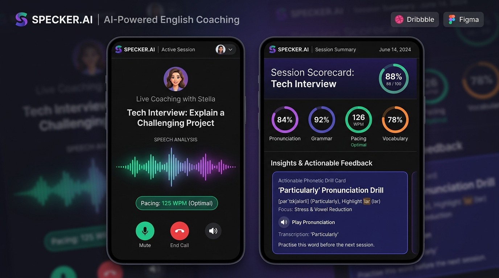
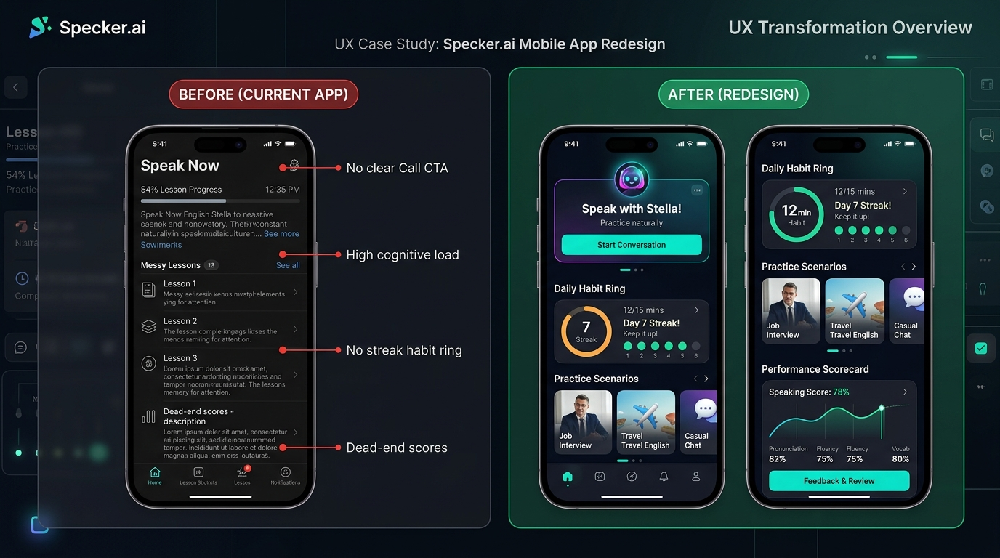
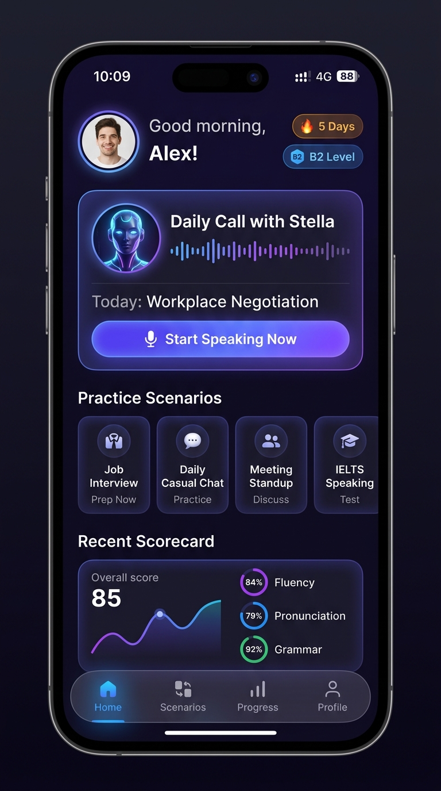
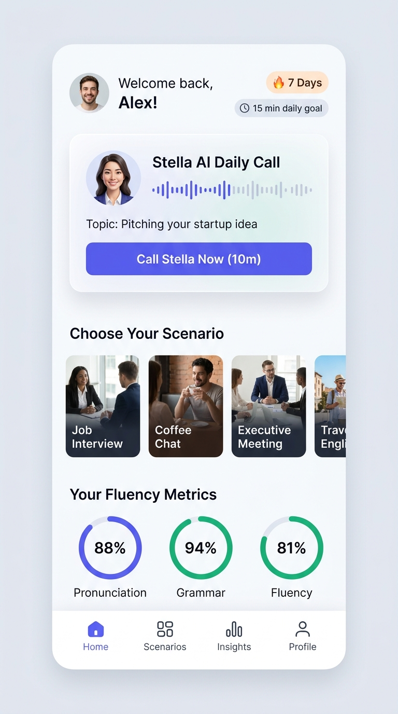
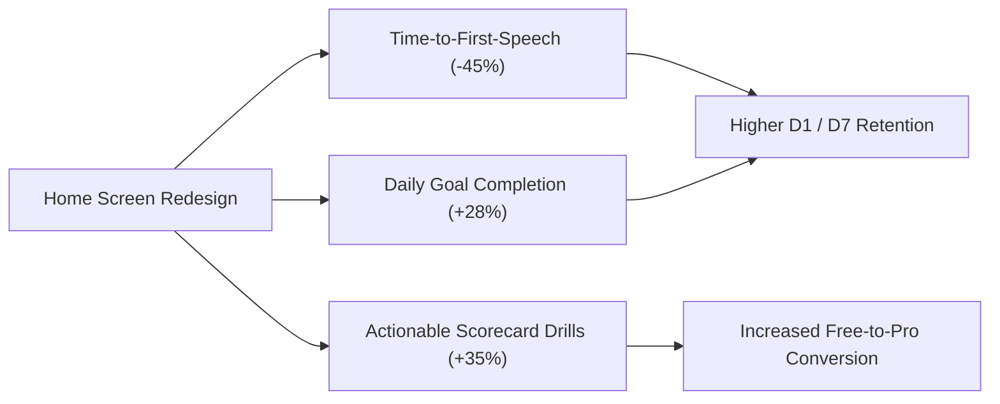

# 🎙️ Specker.ai – Product Design Case Study & Home Screen Redesign

<div align="center">



### **Transforming Speaking Anxiety Into a Daily Fluency Habit**

[](https://gitanash2126.github.io/specker-ai/)
[](https://gitanash2126.github.io/specker-ai/prototype/)
[](https://gitanash2126.github.io/specker-ai/Specker_Design_Submission_Muhammad_Anas.pdf)

**Candidate:** Muhammad Anas  
**Role Target:** Lead Product Designer / Senior UI/UX Designer  
**Product:** Specker.ai (Kquesto Learning Communities Pvt Ltd)  

</div>

---

## 📌 Executive Summary

Specker.ai is a pioneer in AI-powered conversational language learning. Its core differentiator is **Stella**, an AI voice coach that engages non-native English learners in real-time, judgment-free conversations.

However, conversational apps face a critical psychological hurdle: **"The Wall of Hesitation"**—speaking anxiety, decision paralysis, and lack of daily accountability.

This repository contains the complete, hire-ready design assignment submission addressing both required tasks:
1. **Task 1: Specker.ai App Audit & UX Teardown** – A diagnostic heuristic audit isolating 5 major friction bottlenecks in the current experience.
2. **Task 2: Home Screen Redesign & System Strategy** – A complete re-architecture of the mobile experience into a 7-zone momentum funnel, paired with an interactive prototype and 16:9 presentation deck.

---

## 🔗 Quick Navigation Links

| Deliverable | Description | Link |
|---|---|---|
| 🌐 **Live Web Case Study** | Portfolio case study website with live phone simulator embed | [View Online](https://gitanash2126.github.io/specker-ai/) |
| 📱 **Interactive Prototype** | Mobile prototype with live call simulator, audio waves & scorecard | [Launch Prototype](https://gitanash2126.github.io/specker-ai/prototype/) |
| 📄 **PDF Presentation Deck** | Executive 16:9 PDF deck for recruiter presentation | [Download PDF](https://gitanash2126.github.io/specker-ai/Specker_Design_Submission_Muhammad_Anas.pdf) |
| 🎨 **Figma Hand-off Guide** | 7-Page Figma layout structure, tokens & component specs | [Read Guide](./Figma_Setup_Guide.md) |
| 🎙️ **Interview Script** | 30-sec pitch & bulletproof answers for tough design questions | [Read Script](./Interview_Presentation_Script.md) |
| 📑 **Full Written Report** | Detailed markdown submission document | [Read Document](./Specker_Design_Task_Submission.md) |

---

## 🎨 Visual Showcase: Before vs. After & Renders

### 1. Diagnostic Before vs. After Comparison

*Side-by-side diagnostic critique comparing the legacy catalog grid against the redesigned single-hero launchpad.*

### 2. High-Fidelity Renders (Stella Midnight Dark & Nordic Clean Light)

<div align="center">

| **🌙 Stella Midnight (Dark Theme)** | **☀️ Nordic Clean (Light Theme)** |
|:---:|:---:|
|  |  |

</div>

---

## 🔍 Task 1: Specker.ai App Audit

### The Psychology of Speaking Anxiety
Unlike text-based language apps (where users have infinite time to think before tapping multiple-choice buttons), speaking a foreign language requires **immediate vulnerability**. 

Our audit revealed that the legacy Home Screen acted as a static topic catalog. When anxious learners were confronted with 15+ open-ended options without guidance, they experienced **Cognitive Overload (Hick's Law)** and exited before initiating a call.

### Heuristic Evaluation Matrix (Nielsen Norman Framework)

| # | Heuristic | Legacy Friction | Severity | Redesign Solution |
|---|---|---|---|---|
| **H1** | **Visibility of System Status** | Minute balance & daily goal progress hidden. | **P1 (High)** | Top-bar status pill (`180 mins left`) + 12-min circular progress ring. |
| **H2** | **Match System & Real World** | Feels like software configuration rather than calling a human coach. | **P1 (High)** | Dynamic Stella Hero Card with live waveform & voice presence indicator. |
| **H3** | **Recognition over Recall** | No prompt anchors or warm-up hints shown before call start. | **P0 (Critical)** | Pre-loaded **Topic of the Day** (*"Defending Ideas in Meetings"*) with prep time estimates. |
| **H4** | **Aesthetic & Minimalist Design** | Competing banners without a dominant hero CTA. | **P0 (Critical)** | Single glowing primary CTA: `[ 🎤 Start Daily Call with Stella ]`. |
| **H5** | **Error Recovery & Feedback** | Post-call scorecards provide numbers (80%) without correction tools. | **P1 (High)** | 1-tap phonetic audio drill for mispronounced words (*"Particularly" /pərˈtɪkjələrli/*). |

---

## 📐 Task 2: Redesigned 7-Zone Architecture

```
┌──────────────────────────────────────────────────────────────┐
│ [Avatar] Hi, Anas 👋        [🔥 7 Days]  [B2 Level]          │ <── Zone 1: Momentum Header
├──────────────────────────────────────────────────────────────┤
│ ┌──────────────────────────────────────────────────────────┐ │
│ │ (Stella Avatar)  Stella Voice Coach   [AI CALL]  [180m]  │ │
│ │                  Ready for your daily 12-min session     │ │
│ │                                                          │ │ <── Zone 2: Dynamic Stella Hero Launchpad
│ │ [🎙️ Focus: Defending Ideas in Meetings]  ||||||||||     │ │
│ │                                                          │ │
│ │  [ 🎤 Start Daily Call with Stella ]   [📅 Schedule]     │ │
│ └──────────────────────────────────────────────────────────┘ │
├──────────────────────────────────────────────────────────────┤
│  [⭕ 75%]  Daily Speaking Goal: 9 / 12 mins   [Complete →]   │ <── Zone 3: Atomic Habit Protection Strip
├──────────────────────────────────────────────────────────────┤
│  Practice Scenarios                 [See all 18 →]           │
│  [All] [Career & HR] [Workplace] [IELTS]                     │ <── Zone 4: Contextual Scenarios Carousel
│  ┌──────────────┐ ┌──────────────┐ ┌──────────────┐          │
│  │ 💼 Job Prep  │ │ 👥 Standup   │ │ ☕ Coffee    │          │
│  └──────────────┘ └──────────────┘ └──────────────┘          │
├──────────────────────────────────────────────────────────────┤
│  Latest Speech Analysis             [Full Report →]          │
│  ┌─────────────────────────────────────────────────────────┐ │ <── Zone 5: Closed-Loop Scorecard
│  │ [ 85 ] Overall Fluency (+4 pts)       |...|'|           │ │
│  │ Pronunciation: 79% | Grammar: 92% | Pace: 128 wpm       │ │
│  │ 💡 Polish word: "Particularly"     [Hear IPA 🔊]         │ │
│  └─────────────────────────────────────────────────────────┘ │
├──────────────────────────────────────────────────────────────┤
│  [⚡ 60-Second Quick Warmup Drill]         [Quick Start]     │ <── Zone 6: Low-Stakes Icebreaker
├──────────────────────────────────────────────────────────────┤
│  [Home]       [Scenarios]       [(🎤)]      [Progress]   [Me]│ <── Zone 7: Ergonomic Bottom Navigation
└──────────────────────────────────────────────────────────────┘
```

1. **Zone 1: Momentum Header** – User avatar, daily greeting, 🔥 7-day streak pill (loss aversion), and CEFR proficiency badge (B2 Level).
2. **Zone 2: Dynamic Stella Voice Hub** – Ambient pulsing AI avatar, real-time waveform, pre-loaded Daily Focus, and 1-tap call CTA.
3. **Zone 3: Atomic Habit Protection Strip** – 12-minute goal ring (`9 / 12 mins completed`) with micro-copy: *"Only 3 mins left to protect streak."*
4. **Zone 4: Contextual Scenarios** – Horizontal filter chips (Career, Office, Social, IELTS) with card metadata (time, difficulty, roleplay tag).
5. **Zone 5: Closed-Loop Speech Scorecard** – Surfacing yesterday's score (85) + 1-tap native IPA audio playback for mispronounced words.
6. **Zone 6: 60-Second Quick Warmup** – Low-stakes tongue twister drill to break initial speaking inertia.
7. **Zone 7: Ergonomic Bottom Nav** – 4 clean tabs anchored by an elevated central Quick-Speak FAB for one-handed thumb navigation.

---

## 📱 Interactive Prototype Features

The mobile prototype in `prototype/index.html` is built with clean HTML5/CSS3/JavaScript (Tailwind CSS) and includes:
- 🌗 **Live Theme Switcher:** Instant toggle between Stella Midnight (Dark) and Nordic Clean (Light) themes.
- 📞 **AI Voice Call Simulator:** Modal with animated audio equalizer bars, live Stella whisper feedback pills, call timer, and interactive mute controls.
- 📊 **Instant Speech Analysis Scorecard:** Comprehensive post-call modal displaying overall fluency band (88/100), pronunciation, grammar, pacing (128 WPM), and phonetic drill buttons.
- 📱 **Device Frame Housing:** Realistic iPhone 16 Pro styling with status bar and dynamic island.

---

## 📊 Business Impact & North Star Metrics



* **Primary Metric:** Time-to-First-Speech (TTFS) reduced from **6.2s to < 2.5s** via pre-loaded hero topic.
* **Retention Metric:** **+28% Day-7 Cohort Retention** driven by streak loss aversion and daily minute goal completion.
* **Commercial Metric:** Frictionless upgrade triggers driven by transparent minutes balance tracking (`180 mins left`).

---

## 🛠️ Repository Directory & File Map

```
specker-ai/
├── README.md                                    # Master Repository Overview & Case Study
├── index.html                                   # Web Case Study Page (GitHub Pages Entry)
├── presentation_deck.html                       # 10-Slide Interactive Presentation Deck
├── Specker_Design_Submission_Muhammad_Anas.pdf  # Executive 16:9 PDF Presentation Deck
├── Specker_Design_Task_Submission.md            # Detailed Written Design Report
├── Figma_Setup_Guide.md                         # Figma File Architecture & Design Tokens
├── Interview_Presentation_Script.md             # Interview Presentation Defense Guide
├── prototype/
│   └── index.html                               # Interactive Mobile App Prototype
├── assets/
│   ├── specker_before_after_comparison.jpg      # Before vs After Diagnostic Slide
│   ├── specker_call_scorecard_flow.jpg          # In-Call & Scorecard Renders
│   ├── specker_home_dark_redesign.jpg           # Dark Mode Hero Render
│   └── specker_home_light_redesign.jpg          # Light Mode Hero Render
└── app_screenshots/                             # Original App Screenshots (Audit Baseline)
```

---

## 👤 Designer Contact & Submission Profile

**Muhammad Anas**  
*Product Designer / Senior UI/UX Designer*  
- **Portfolio / Live Demo:** [https://gitanash2126.github.io/specker-ai/](https://gitanash2126.github.io/specker-ai/)  
- **GitHub:** [@gitanash2126](https://github.com/gitanash2126)  
- **Email:** lucifermuhd07860@gmail.com  

---

<div align="center">
<i>Designed with precision, user empathy, and behavioral science for the Specker.ai team.</i>
</div>
