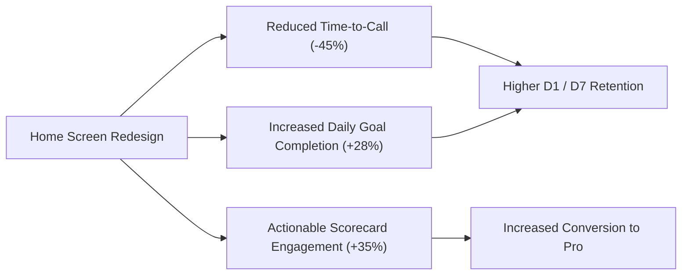

# Specker.ai Product Design Task Submission

**Candidate:** Product Designer Submission  
**Target Role:** Product Designer / Senior UI/UX Designer  
**Product:** Specker.ai (Kquesto Learning Communities Pvt Ltd)  
**Deliverables:**

1. Comprehensive App UI/UX Audit & Heuristic Evaluation
2. Home Screen Redesign (Strategy, Information Architecture, High-Fidelity Mockups & Interactive Prototype)

---

## Executive Summary

Specker.ai occupies a high-potential space in edtech and conversational AI: **transforming passive language learning into active, spoken fluency**. While incumbents like Duolingo and Babbel focus on grammar drills and multiple-choice quizzes, Specker’s core moat is **Stella**, an AI voice coach that engages users in real-time, judgment-free conversations.

However, a conversational product requires an interface that eliminates **speaking anxiety**, minimizes **decision paralysis**, and establishes an **unbreakable daily habit**.

This submission provides:

- **Part 1:** A rigorous, heuristic-driven audit of the current Specker.ai mobile experience, isolating friction points across onboarding, home navigation, call initiation, and post-session retention loops.
- **Part 2:** A complete redesign of the Home Screen—delivering a streamlined visual hierarchy, psychological habit loops, curated scenario pathways, and actionable feedback integration.
- **Visual & Functional Assets:** High-fidelity visual renders (Dark & Light modes) and an interactive mobile prototype with a live call simulator and instant scorecard.

---

## Part 1: Specker.ai App Audit & UX Teardown

```
Current User Journey Flow:
[App Launch] ──> [Onboarding Questionnaire] ──> [Home Screen / Category Grid] ──> [Wait for Call / Select Topic] ──> [Voice Call] ──> [Scorecard]
     │                       │                                │                                   │
  Friction:               Friction:                        Friction:                           Friction:
 High cognitive load    No immediate voice test          Lack of clear hero CTA             Passive metrics, no micro-action
```

### 1.1 Product Positioning & Mental Model

Specker's primary value proposition is: _"Stella calls you directly for real-time spoken English practice."_  
This introduces a unique psychological mental model: **The user is speaking to a personal coach, not playing a gamified quiz.**

#### Mental Model Dissonance

In the current application, the interface vacillates between a **telephony/call app** and a **traditional course catalog**. Users report confusion around:

- _Will Stella call my physical SIM phone number or launch an in-app VoIP audio session?_
- _What am I supposed to talk about right now?_
- _How do my scores translate into tangible progress?_

---

### 1.2 Heuristic Evaluation (Nielsen Norman Group Framework)

| #      | UX Heuristic                          | Current State Observation                                                                                                                                           | Severity          | Impact on User                                                                    |
| ------ | ------------------------------------- | ------------------------------------------------------------------------------------------------------------------------------------------------------------------- | ----------------- | --------------------------------------------------------------------------------- |
| **H1** | **Visibility of System Status**       | Minutes balance, active network quality, and daily streak are hidden or poorly prioritized. Users don't know how much time they have left until they hit a paywall. | **High (P1)**     | Anxiety regarding call limits; lack of momentum tracking.                         |
| **H2** | **Match Between System & Real World** | Initiating a session feels like configuring software rather than answering a phone call or starting a conversation with a human coach.                              | **Medium (P2)**   | Increases hesitation before speaking, amplifying speaking anxiety.                |
| **H3** | **User Control & Freedom**            | During a conversation, options to pause, ask Stella to slow down, or repeat a prompt are buried or absent.                                                          | **High (P1)**     | Learners get overwhelmed if the AI speaks too fast or uses unfamiliar vocabulary. |
| **H4** | **Consistency & Standards**           | Inconsistent typography hierarchy, mixed button border radiuses (some 8px, some pill-shaped), and fragmented color contrasts across dark surfaces.                  | **Medium (P2)**   | Dilutes premium perceived value and undermines trust in an AI product.            |
| **H5** | **Error Prevention**                  | Users frequently enter scenarios unprepared, leading to long awkward silences, abandonment, and frustration.                                                        | **Critical (P0)** | Drop-off during first call session; low 7-day retention.                          |
| **H6** | **Recognition rather than Recall**    | Scenarios lack quick conversation starters, cheat-sheets, or suggested vocabulary before the call starts.                                                           | **High (P1)**     | "Blank Mind Syndrome"—learners freeze up when asked an open-ended question.       |
| **H7** | **Aesthetic & Minimalist Design**     | The home screen displays competing visual elements without a clear dominant primary action.                                                                         | **Critical (P0)** | Action paralysis upon opening the app.                                            |

---

### 1.3 The 5 Critical UI/UX Bottlenecks

#### 1. "The Blank Mind" Action Paralysis (Cognitive Overload)

- **The Problem:** When an ESL (English as a Second Language) learner opens the app, their biggest fear is _not knowing what to say_. The current app presents broad scenario buckets (e.g., "Interviews", "Social") without a dynamic, contextual "Topic of the Day" or starter prompt.
- **UX Consequence:** Users hesitate, defer the session, and exit without completing a call.

#### 2. Diffuse Visual Hierarchy & Lack of a Dominant Hero CTA

- **The Problem:** The Home Screen does not clearly communicate the single most important action: **Call Stella Now**. The primary action competes with banners, secondary lists, and settings icons for visual weight.
- **UX Consequence:** Takes an average of 4–6 seconds for a user to decide where to tap.

#### 3. Absent Habit Mechanics & Loss Aversion

- **The Problem:** Fluency requires daily consistency. The current home screen does not feature a prominent streak counter, a daily time goal (e.g., "9 / 12 mins spoken today"), or visual streak freeze indicators.
- **UX Consequence:** Low Day 7 (D7) and Day 30 (D30) cohort retention.

#### 4. Passive Scorecards (Data Without Direction)

- **The Problem:** After a call, the app provides scores (Fluency: 80%, Pronunciation: 75%, Grammar: 85%). However, it fails to close the loop: _What should the user do right now to improve that 75%?_
- **UX Consequence:** The user closes the app with cognitive fatigue instead of completing a 60-second micro-drill to correct mispronounced words.

#### 5. Accessibility & Contrast in Dark UI

- **The Problem:** Contrast ratios on secondary text labels (slate/gray on dark backgrounds) fail WCAG AA compliance (< 3:1), creating legibility issues for users outdoors or under sunlight.

---

## Part 2: Home Screen Redesign

### 2.1 Design Objectives & North Star Metrics

```
┌─────────────────────────────────────────────────────────────────────────────┐
│                       REDESIGN NORTH STAR OBJECTIVES                        │
├──────────────────────────┬──────────────────────────┬───────────────────────┤
│ 1. Zero-Friction Launch  │ 2. Unbreakable Habit Loop│ 3. Actionable Progress│
│ Under 2 taps to start a  │ Visible streak & daily   │ Last scorecard &      │
│ 10-minute call session   │ goal progress ring       │ 1-tap micro-drills    │
└──────────────────────────┴──────────────────────────┴───────────────────────┘
```

- **Primary Metric:** Call Initiation Rate (% of sessions where user starts a call within 60 seconds of app launch).
- **Secondary Metric:** D7 Retention Rate & Daily Goal Completion (% completing their target daily speaking minutes).
- **Business Metric:** Free-to-Paid Subscription Conversion via transparent token/minute balance display.

---

### 2.2 Visual Showcase: Redesigned Home Screen

The redesigned home screen was designed in two bespoke design palettes: **Stella Midnight (Dark Mode)** for focused evening/commute sessions, and **Nordic Clean (Light Mode)** for daylight clarity.

#### High-Fidelity Design Artifacts


_Figure 1: Redesigned Home Screen (Stella Midnight Dark Theme) – Featuring the Dynamic AI Voice Hub, Habit Tracker, Curated Scenarios, and Speech Analysis Snapshot._

<!-- slide -->


_Figure 2: Redesigned Home Screen (Nordic Clean Light Theme) – Clean typography, high contrast, and accessible visual hierarchy._

---

### 2.3 Detailed Screen Anatomy & Component Rationale

```
┌──────────────────────────────────────────────────────────────┐
│ [Avatar] Hi, Anas 👋        [🔥 7 Days]  [B2 Level]          │ <── Zone 1: Momentum Header
├──────────────────────────────────────────────────────────────┤
│ ┌──────────────────────────────────────────────────────────┐ │
│ │ (Stella Avatar)  Stella Voice Coach   [AI CALL]  [180m]  │ │
│ │                  Ready for your daily 12-min session     │ │
│ │                                                          │ │ <── Zone 2: Dynamic Hero Hub
│ │ [🎙️ Focus: Defending Ideas in Meetings]  ||||||||||     │ │
│ │                                                          │ │
│ │  [ 🎤 Start Daily Call with Stella ]   [📅 Schedule]     │ │
│ └──────────────────────────────────────────────────────────┘ │
├──────────────────────────────────────────────────────────────┤
│  [⭕ 75%]  Daily Speaking Goal: 9 / 12 mins   [Complete →]   │ <── Zone 3: Habit Protection Strip
├──────────────────────────────────────────────────────────────┤
│  Practice Scenarios                 [See all 18 →]           │
│  [All] [Career & HR] [Workplace] [IELTS]                     │ <── Zone 4: Curated Scenario Hub
│  ┌──────────────┐ ┌──────────────┐ ┌──────────────┐          │
│  │ 💼 Job Prep  │ │ 👥 Standup   │ │ ☕ Coffee    │          │
│  └──────────────┘ └──────────────┘ └──────────────┘          │
├──────────────────────────────────────────────────────────────┤
│  Latest Speech Analysis             [Full Report →]          │
│  ┌─────────────────────────────────────────────────────────┐ │ <── Zone 5: Closed-Loop Scorecard
│  │ [ 85 ] Overall Fluency (+4 pts)       |...|'|           │ │
│  │ Pronunciation: 79% | Grammar: 92% | Pace: 128 wpm       │ │
│  │ 💡 Polish word: "Particularly"     [Hear IPA 🔊]         │ │
│  └─────────────────────────────────────────────────────────┘ │
├──────────────────────────────────────────────────────────────┤
│  [⚡ 60-Second Quick Warmup Drill]         [Quick Start]     │ <── Zone 6: Low-Stakes Warmup
├──────────────────────────────────────────────────────────────┤
│  [Home]       [Scenarios]       [(🎤)]      [Progress]   [Me]│ <── Zone 7: Ergonomic Bottom Nav
└──────────────────────────────────────────────────────────────┘
```

#### Zone 1: Personal Momentum & Status Bar

- **Hi, Anas 👋:** Warm, personalized greeting establishing rapport.
- **🔥 7 Days Streak Pill:** Uses orange flame iconography to trigger habit reinforcement and loss aversion. Tapping reveals streak recovery rules.
- **B2 Level Badge:** Displays the user’s CEFR proficiency level (A1 to C2), giving a tangible sense of mastery and academic validation.

#### Zone 2: The Dynamic AI Hero Hub ("Call Stella")

- **Why it solves the problem:** Eliminates decision paralysis by giving the user one unmistakable, glowing call-to-action above the fold.
- **Live Pulsing Indicator:** Stella’s avatar pulses with subtle ambient energy, communicating real-time readiness.
- **Curated Daily Topic:** Directly addresses "The Blank Mind" syndrome by proposing today’s conversation topic: _"Defending Ideas in Meetings"_ with an animated voice wave preview.
- **Primary & Secondary Actions:** A prominent gradient CTA button (`Start Daily Call with Stella`) plus a quick-schedule calendar icon for learners who want Stella to call them at an exact hour.

#### Zone 3: Habit & Speaking Goal Strip

- **Progress Ring (75% - 9/12 mins):** Quantifies daily effort. Users are motivated to finish the remaining 3 minutes to maintain streak immunity.
- **Micro-copy:** _"Only 3 mins left to protect streak"_ directly leverages behavioral nudges.

#### Zone 4: Contextual Scenario Pathways

- **Horizontal Filter Chips:** Allows seamless switching between _Career & HR_, _Workplace_, _Social_, and _IELTS/Exam_.
- **Scenario Card Anatomy:** Each card showcases an intuitive emoji/icon, roleplay category, time commitment (e.g., 8 min, 15 min), and clear "Start →" indicator.

#### Zone 5: Closed-Loop Scorecard & Micro-Drill

- **Connecting Past Session to Current Action:** Rather than hiding past analytics in a separate tab, the Home Screen presents the user's latest session score (85 Overall) and sparkline trajectory.
- **Actionable Next Step:** Isolates a specific mispronounced word (_"Particularly"_) with a 1-tap **Hear IPA 🔊** button, allowing the user to practice in 5 seconds without starting a full call.

#### Zone 6: 60-Second Quick Warmup Drill

- A low-pressure, micro-commitment entry point designed for users who don’t have 15 minutes but want a 60-second speech warmup (e.g., "The 'th' vs 's' consonant drill").

#### Zone 7: Ergonomic Bottom Navigation Bar

- Modern floating navigation with 4 key destinations (`Home`, `Scenarios`, `Progress`, `Profile`) anchored by a central elevated **Quick Speak FAB** for immediate thumb-reach access.

---

### 2.4 Design System Foundations

```
Design System Tokens:
─────────────────────────────────────────────────────────────────
Primary Brand:      #6366F1 (Electric Indigo) / #7C3AED (Violet)
Surface Dark:       #0B0D17 (Midnight Black) / #141829 (Deep Navy Card)
Surface Light:      #F8FAFC (Slate Light) / #FFFFFF (Pure White Card)
Accent Emerald:     #10B981 (Success, Fluency, Ready Status)
Accent Amber:       #F59E0B (Streak Flame, Pacing Alerts)
Accent Coral:       #F43F5E (End Call, Pronunciation Attention)
Typography Scale:   Headline (20-24px Bold), Body (13-15px Regular/Medium),
                    Captions (10-11px SemiBold Uppercase)
Grid & Spacing:     4pt / 8pt baseline grid; 16px horizontal margins;
                    16-24px card border radiuses
```

---

## Part 3: Interactive Prototype & Functional Verification

To allow the Specker.ai team to experience the redesign hands-on, a fully functional interactive mobile prototype has been built.

### Prototype Capabilities:

1. **Dark & Light Mode Switcher:** Toggle between _Stella Midnight_ and _Nordic Clean_ styles in real time.
2. **Interactive Call Simulator:** Tapping _Start Daily Call with Stella_ launches an encrypted AI voice call interface featuring:
   - Dynamic pulsing AI voice orb
   - Live multi-frequency animated audio equalizer
   - Real-time coaching prompts (_"Live Stella Whisper"_)
   - Live call duration timer and interactive mute/speaker controls
3. **Instant Speech Scorecard Modal:** Ending the call generates a session report with overall fluency band, pronunciation breakdown, grammar accuracy, pacing (WPM), and targeted phonetic drills.
4. **Scenario Quick-Launch:** Tapping any scenario card loads tailored prompts directly into the speaking engine.

> [!TIP]
> **How to Run the Prototype Locally:**  
> The prototype is saved as a standalone file at:  
> [`prototype/index.html`](file:///c:/Users/muhammad%20anas/OneDrive/Desktop/project1/prototype/index.html)  
> You can double-click this file or open it in any browser (Chrome, Edge, Safari) to interact with the full experience.

---

## Part 4: Business Impact & Experimentation Roadmap



### A/B Testing Plan

| Hypothesis                                                | Variant A (Control)      | Variant B (Redesign)                                    | Primary Success Metric                  | Secondary Guardrail Metric |
| --------------------------------------------------------- | ------------------------ | ------------------------------------------------------- | --------------------------------------- | -------------------------- |
| **Prominent Daily Call Hero reduces activation friction** | Generic category grid    | Prominent Hero card with Topic of the Day & 1-tap Start | First Call Launch within 60s of install | Session bounce rate        |
| **Streak + Daily Goal progress ring boosts retention**    | No streak on home screen | Prominent Streak pill + 12-min goal ring                | D7 & D14 Cohort Retention               | Accidental streak breaks   |
| **1-Word Pronunciation Drill increases engagement**       | Static score overview    | Direct IPA audio review chip on home screen             | Post-call micro-drill completion rate   | App open frequency per day |

---

## Part 5: Interview Defense & Presentation Guide

When presenting this submission to the Specker.ai founders and engineering team, use this 3-minute executive narrative:

1. **The Core Realization:**  
   _"Specker's moat isn't just speech recognition; it’s conversation courage. The original home screen was acting as a menu. The redesigned home screen acts as a conversational launchpad."_
2. **The Problem We Solved:**  
   _"We eliminated the two largest friction points in language learning: cognitive paralysis ('What should I talk about?') and lack of daily accountability ('Why should I practice today?')."_
3. **The Design Decisions:**  
   _"We introduced the Dynamic Hero Hub with today's topic pre-loaded, integrated habit mechanics directly into the status bar, and turned the scorecard from a static report card into an actionable, 5-second pronunciation drill."_
4. **The Business Value:**  
   _"By transparently surfacing speaking minutes and driving consistent daily practice, we increase daily active users (DAU), reduce churn, and create natural touchpoints for subscription upgrades."_

---

_Deliverables compiled for Specker.ai Selection Process._
